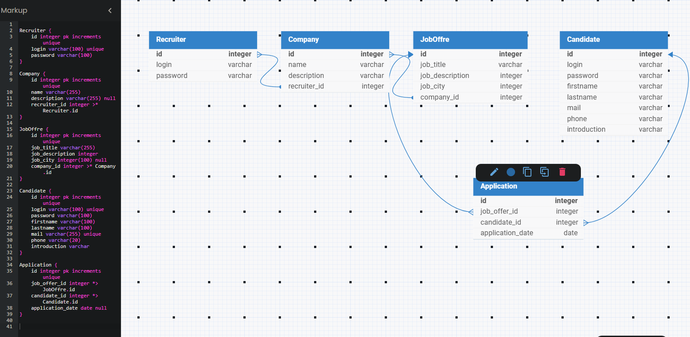

2. SQL
   - Crée la base de données avec SQLite, tu peux utiliser https://sqlime.org/ pour cela.
   - Remplis-la avec des données fictives en utilisant des requêtes SQL. (N'hésites pas à regarder des outils comme https://www.mockaroo.com/ pour cela).
   - Ajoutes le ou les scripts .sql d'insertion au dossier BDD.

3. Écris ensuite les requêtes SQL permettant d'obtenir les informations suivantes : (Fichiers de requêtes à mettre dans le dossier BDD)
   - Toutes les offres d'emploi
   - Toutes les offres d'emploi d'une ville (Paris)
   - Les informations de tous candidats qui ont postulé à une offre précise
   - Les informations de tous les candidats qui ont postulé aux offres d'une entreprise

## Part two

En t'intégrant dans [le code des algos de tableau existants dans ce projet](arr.ts), ajoute les méthodes `pop()` et `shift()`.
N'oublie pas de mettre en place [les tests unitaires](test/array.test.ts). 

💡 De préférence, rédige les tests unitaires avant d'écrire le code afin de t'inscrire dans une démarche TDD.
